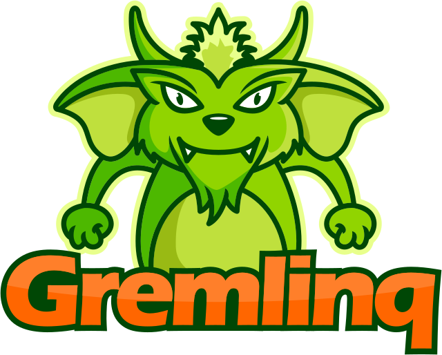

---
hide:
  - navigation
---
#
<p align="center">
  
</p>

## :fontawesome-solid-play: Introduction
ExRam.Gremlinq is a .NET object-graph-mapper (OGM) for [Apache TinkerPop™](http://tinkerpop.apache.org/)
enabled databases. An OGM on the .NET platform is for the realm of graph-databases what, 
among others, Entity Framework or NHibernate (generally called object-relational-mappers, or ORMs)
are for relational databases.

TinkerPop-enabled graph databases are queried by a graph query language called Gremlin. ExRam.Gremlinq enables
.NET developers to create and issue this kind of queries in a strongly-typed fashion by using the
powerful Gremlinq-DSL abstraction over their own model of domain entity classes (usually called POCOs). It
will serialize the query to valid Gremlin for execution on the server and deserialize the results
to the correct .NET types.

## :fontawesome-solid-rocket: Features

??? success "Type safety"
    ExRam.Gremlinq queries carry and pass on full information about the query result type and its role
    (vertex, edge, scalar etc.). This minimizes the possibility of writing and executing invalid queries,
    speeding up development.

    ??? example
    
        For a simple example, let's assume the domain of a simple pet-shop with classes `Cat` and
        `Dog` that both inherit from an abstract base class `Animal`. A plain Gremlin-query asking for all
        Cats in the database named 'Poppy' would look like this:

        ```groovy
        g.V().hasLabel('Cat').has('Name', 'Poppy')
        ```

        ExRam.Gremlinq allows for issuing this query using type-safe C# language constructs over the `Cat`-class:

        ```csharp
        var cats = _g.V<Cat>().Where(cat => cat.Name == "Poppy").ToArrayAsync()
        ```

        At every step in the query, ExRam.Gremlinq is aware that it is dealing with vertices of type 
        `Cat` and, upon retrieval of results from the server, deseriailze these into instances of type `Cat`.

??? success "Inheritance"
    ExRam.Gremlinq supports type hierarchies of vertex- and edge-types and is able to determine
    the set of valid element-label to use in the transformed query executed on the server.

    ??? example

        Assuming the above domain, a query for alll vertices of type `Animal` will, under the hood, 
        query for the `Cat` resp. `Dog` labels and return correct instances of either types when the query 
        returns, i.e.

        ```csharp
        var animals = _g.V<Animal>().ToArrayAsync()
        ```

        will query for vertices labelled either `Cat` or `Dog` and deserialize accordingly.
    

??? success "Powerful DSL"
    The type system of ExRam.Gremlinq itself, represented as various fluent interfaces that carry result
    type information, enables developers to rapidly write correct queries.

    ??? example
        Again assuming the above domain, enriched with `SoldTo` and `Customer` classes that represent
        edges labelled `SoldTo` pointing from `Animals` to `Customers`, we can query for the customer that
        bought a cat named 'Poppy':

        ```csharp
        var cat = g.V<Cat>().Where(cat => cat.Name == "Poppy").Out<SoldTo>().OfType<Customer>().FirstOfDefaultAsync()
        ```

        The ExRam.Gremlinq DSL will only allow fluently using the `Out<...>` method if it knows that it's
        currently on a vertex. This avoids accidentally trying to walk edges from e.g. edges or scalar values.
        The Gremlin language by itself does not prohibit writing such queries, so that bugs could only
        be detected during integration tests or, even worse, in production.

??? success "Expression-parsing"
    ExRam.Gremlinq is capable of recognizing a wide range of C#-expressions and generate valid Gremlin.
    This enables developers to focus on the business logic in the language they're comfortable with, instead
    of dealing directly with the Gremlin query language.

    ??? example
        For example, querying for all the Cats whose name starts with the letter "B", the query

        ``` csharp
        var cats = await _g.V<Cat>().Where(x => x.Name.Value.StartsWith("B")).ToArrayAsync();
        ```

        will correctly be translated into proper Gremlin syntax for execution on the server.

??? success "Customization"
    ExRam.Gremlinq is extremely customizable, from query serialization to query execution to result 
    deserialization. It allows custom scalar types to be registered for correct (de-)serialization
    to/from native graph types, and query execution to be intercepted.

## :fontawesome-solid-server: Provider support

ExRam.Gremlinq comes with out-of-the-box support for

* AWS Neptune
* Azure Cosmos Db
* JanusGraph
* TinkerPop Gremlin Server

Other providers may just work with the generic Gremlin Server-package, be provided by the community or
be part of the commercial extension package.


